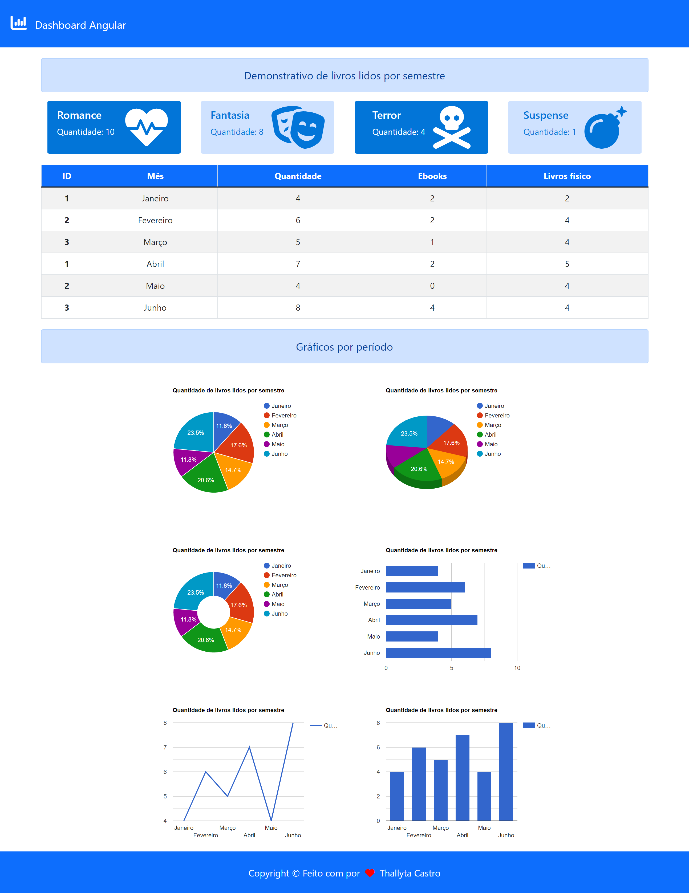

# Dashboard Angular


<b> Este projeto foi criado com Angular CLI 13.2.3 para colocar em prática o aprendizado sobre programação reativa com Observables do Angular </b>

# Sobre o projeto

Este projeto consiste em uma aplicação frontend, onde foi realizado a integração com a API de gráficos do google com o conceito de Observable para fazer um demonstrativo dos dados de livros lidos em um semestre. 

# Layout do projeto



# Tecnologias utilizadas

* HTML
* CSS 
* Javascript
* Fontawesome
* Bootstrap 5
* Google Chart API
* Observable RxJs
* Typescript 4.5.2
* Angular CLI 13.2.3
* Node
* NPM

# Iniciando o projeto
Para iniciar a aplicação execute o seguinte comando na pasta dashboard

```shell script
ng serve
```

# Autor
<b>Thallyta Macedo Carvalho de Castro</b>

Linkedin: https://www.linkedin.com/in/thallyta-castro/

Medium: https://medium.com/@thallyta-castro-cv

email: contato@thallytacastro.com.br
